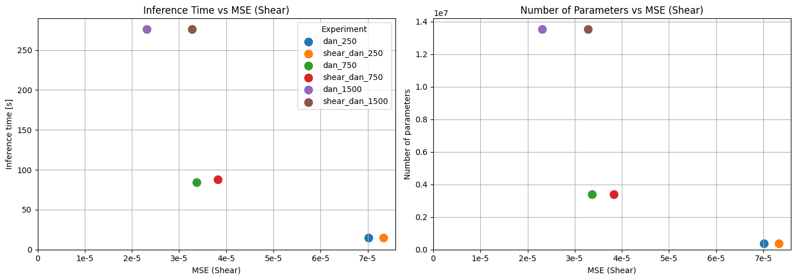
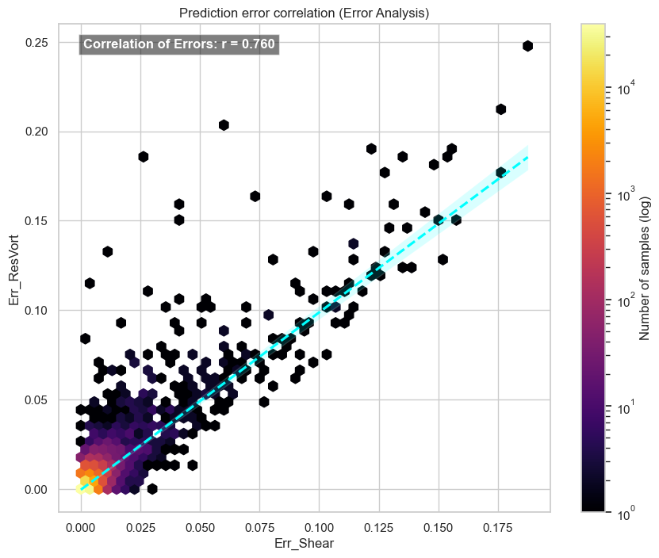
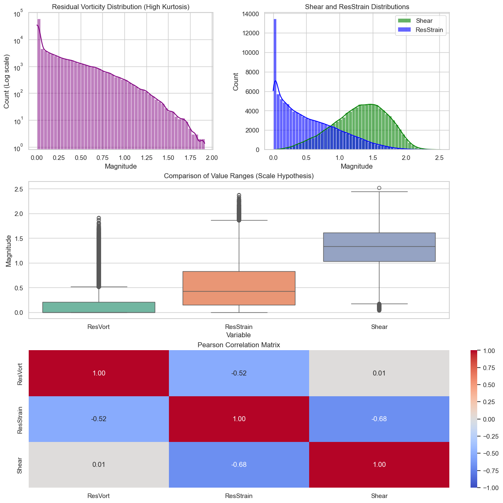

# MathCAS: Modular Neural Network Training Framework

A robust, highly modular PyTorch-based framework tailored for training, evaluating, and profiling neural networks on complex tabular datasets.

Originally developed for research in **compressible fluid flow analysis**, this framework is designed to bridge the gap between rapid academic experimentation and clean, production-ready engineering practices.

> **Note:** This project is an active work in progress. Features and analytical tools may evolve as the research continues.


_(Note: Example output generated by the framework analyzing the trade-off between inference time, parameter count, and Mean Squared Error across various model architectures. Specific physical parameters are anonymized for confidentiality)._

## ✨ Key Features

This repository is built with a strong focus on reproducibility, performance, and clear separation of concerns:

- **⚙️ YAML-Driven Architecture:** Define network layers, learning rates, data splits, and early stopping rules entirely via configuration files (no hardcoding).
- **🚀 NVTX Profiling:** Integrated NVIDIA NVTX markers (`nvtx_range`) in the dataloaders and training loops for deep performance analysis and bottleneck identification.
- **🧠 Advanced Diagnostics (Dying ReLU):** Custom PyTorch forward hooks designed to detect and report "dying" activation neurons across batches during inference.
- **🔄 Full Reproducibility:** Automated experiment directory creation, config hashing, and strict random seed freezing.

## 📊 Exploratory Data Analysis (EDA)

Before feeding data into the PyTorch models, the framework includes robust Jupyter notebook tooling for deep data inspection to ensure feature quality and prevent data leakage.

<p align="center">
  
  
</p>

## 📂 Project Structure

```text
MathCAS/
├── config/             # YAML schema definitions and config loaders
├── datasets/           # Directory for tabular data (gitignored)
├── experiments/        # User-defined YAML configuration files for experiments
├── figures/            # Exported visualizations and plots
├── notebooks/          # Jupyter notebooks for EDA, visualization, and tooling
├── outputs/            # Auto-generated experiment logs, model checkpoints, and hashed configs
├── src/                # Core ML logic (architecture, dataloaders, evaluation)
├── templates/          # Base YAML templates for regression/classification
├── utils/              # Helpers: logger, NVTX profiler, metric computations
└── main.py             # Main entry point for the training pipeline
```

## 🚀 Quickstart

1. **Clone the repository and install dependencies:**

    ```bash
    git clone https://github.com/cervinka479/MathCAS.git
    cd MathCAS
    pip install -r requirements.txt
    ```

2. **Prepare your dataset:** Place your tabular data (`.csv`) in the `datasets/` directory.

3. **Configure your experiment:** Edit the `templates/regression.yaml` file to match your dataset's input/output columns and your desired neural network architecture.

4. **Run the training pipeline:**

    ```bash
    python main.py templates/regression.yaml
    ```

5. **Check outputs:** Trained weights (`best_model.pt`), logs, hashed configs, and metrics are automatically saved into a uniquely named folder inside the `outputs/` directory.

## 🛠️ Configuration & Advanced Tools

- **Experiment Configuration:** The entire training pipeline is controlled via YAML files. You can easily adjust learning rates, architecture, and data splits without modifying the core codebase.
- **Analytical Notebooks:** Check out the `notebooks/` directory for advanced evaluation tools, including dying ReLU inspection and cross-experiment performance visualizations.

## 📄 License

This project is licensed under the MIT License - see the [LICENSE](LICENSE) file for details.
